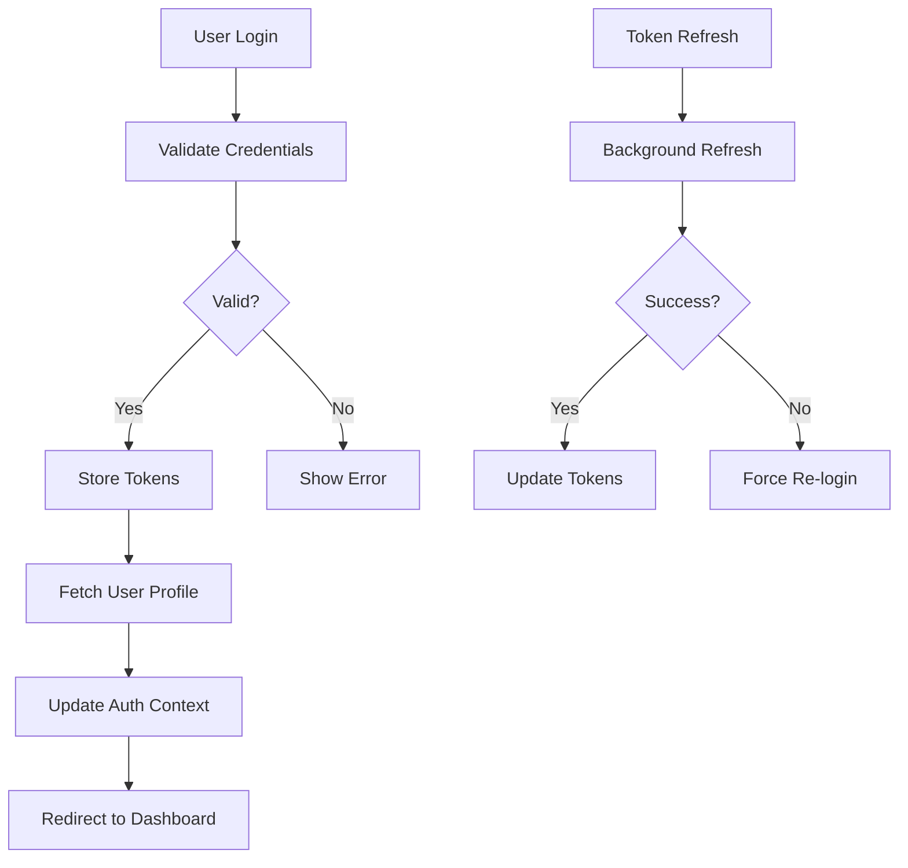
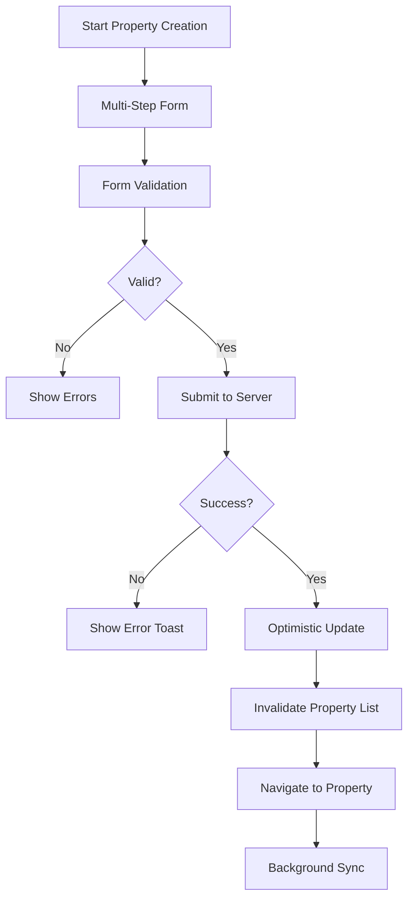
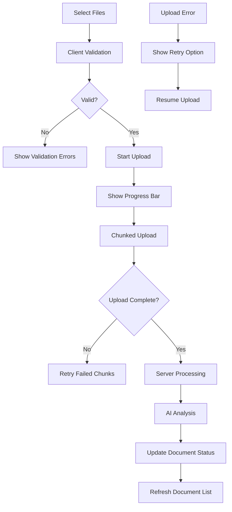
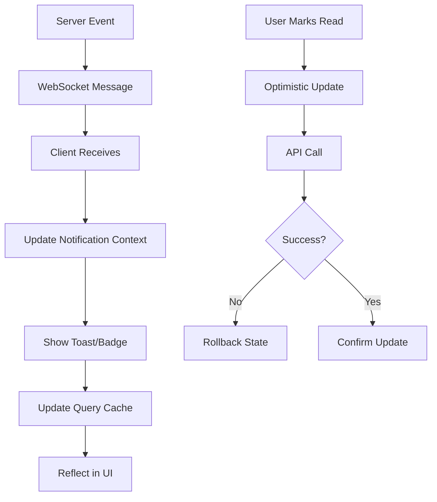

# Paperwurks React Application - Data Design

## Overview

This document outlines the data architecture, storage strategies, and data flow patterns for the Paperwurks React application. The design emphasizes type safety, performance, and clear separation between client-side state and server-side data.

## Data Architecture Principles

### Core Principles

- **Single Source of Truth**: Server state is authoritative, client state is derived
- **Type Safety**: Full TypeScript coverage for all data structures
- **Immutability**: State updates follow immutable patterns
- **Caching Strategy**: Intelligent caching with React Query for server state
- **Optimistic Updates**: Immediate UI feedback for user actions
- **Error Resilience**: Graceful handling of network failures and data inconsistencies

### State Classification

1. **Server State**: Data from APIs that needs synchronization
2. **Client State**: UI state, form data, and local preferences
3. **URL State**: Navigation and shareable application state
4. **Persistent State**: User preferences and cached data

---

## Data Storage Strategy

### Client-Side Storage

#### React Query Cache (Primary Server State)

```typescript
// React Query configuration
const queryClient = new QueryClient({
  defaultOptions: {
    queries: {
      staleTime: 1000 * 60 * 5, // 5 minutes
      cacheTime: 1000 * 60 * 30, // 30 minutes
      retry: 3,
      refetchOnWindowFocus: false,
    },
    mutations: {
      retry: 1,
    },
  },
});
```

**Usage Patterns:**

- Property data caching with background updates
- Document metadata synchronization
- User profile and settings
- Notification state management

#### Local Storage (Persistent Client State)

```typescript
// Storage structure
interface LocalStorageData {
  userPreferences: {
    theme: "light" | "dark";
    language: string;
    notificationSettings: NotificationPreferences;
  };
  authTokens: {
    accessToken: string;
    refreshToken: string;
    expiresAt: number;
  };
  recentlyViewed: {
    properties: string[];
    documents: string[];
  };
  draftForms: {
    [formId: string]: FormDraftData;
  };
}
```

#### Session Storage (Temporary State)

```typescript
interface SessionStorageData {
  uploadProgress: {
    [uploadId: string]: UploadProgressData;
  };
  formWizardState: {
    [wizardId: string]: WizardStepData;
  };
  searchFilters: {
    [pageKey: string]: FilterState;
  };
}
```

#### IndexedDB (Large Data & Offline Support)

```typescript
// IndexedDB structure for offline capabilities
interface OfflineDatabase {
  cachedDocuments: {
    id: string;
    blob: Blob;
    metadata: DocumentMetadata;
    cachedAt: Date;
  };
  syncQueue: {
    id: string;
    operation: "create" | "update" | "delete";
    entity: string;
    data: any;
    timestamp: Date;
  };
}
```

### Server-Side Data Structure

#### Core Entities

```typescript
// Primary data entities
interface User {
  id: string;
  email: string;
  firstName: string;
  lastName: string;
  role: UserRole;
  organization?: Organization;
  permissions: Permission[];
  profile: UserProfile;
  createdAt: Date;
  updatedAt: Date;
}

interface Property {
  id: string;
  ownerId: string;
  agentId?: string;
  solicitorId?: string;
  address: PropertyAddress;
  details: PropertyDetails;
  pack: PropertyPack;
  timeline: TimelineEvent[];
  status: PropertyStatus;
  createdAt: Date;
  updatedAt: Date;
}

interface PropertyPack {
  id: string;
  propertyId: string;
  documents: Document[];
  progress: PackProgress;
  completionPercentage: number;
  requirements: PackRequirement[];
  status: PackStatus;
  sharedWith: SharePermission[];
}

interface Document {
  id: string;
  packId: string;
  uploadedBy: string;
  filename: string;
  originalName: string;
  mimeType: string;
  size: number;
  category: DocumentCategory;
  version: number;
  annotations: Annotation[];
  aiAnalysis?: AIAnalysisResult;
  status: DocumentStatus;
  uploadedAt: Date;
  updatedAt: Date;
}
```

---

## State Management Architecture

### Global State Structure

#### Authentication Context

```typescript
interface AuthState {
  user: User | null;
  permissions: Permission[];
  isAuthenticated: boolean;
  isLoading: boolean;
  error: string | null;
}

interface AuthActions {
  login: (credentials: LoginCredentials) => Promise<void>;
  logout: () => void;
  refreshToken: () => Promise<void>;
  updateProfile: (profile: Partial<UserProfile>) => Promise<void>;
}
```

#### Application Context

```typescript
interface AppState {
  notifications: Notification[];
  activeModals: ModalState[];
  toast: ToastState | null;
  theme: Theme;
  loading: LoadingState;
}

interface AppActions {
  showNotification: (notification: Notification) => void;
  openModal: (modal: ModalConfig) => void;
  closeModal: (modalId: string) => void;
  showToast: (toast: ToastConfig) => void;
  setTheme: (theme: Theme) => void;
}
```

### Feature-Specific State

#### Property Management State

```typescript
// React Query keys and hooks
const propertyKeys = {
  all: ["properties"] as const,
  lists: () => [...propertyKeys.all, "list"] as const,
  list: (filters: PropertyFilters) =>
    [...propertyKeys.lists(), filters] as const,
  details: () => [...propertyKeys.all, "detail"] as const,
  detail: (id: string) => [...propertyKeys.details(), id] as const,
  timeline: (id: string) => [...propertyKeys.detail(id), "timeline"] as const,
};

// Property queries
const useProperties = (filters: PropertyFilters) => {
  return useQuery({
    queryKey: propertyKeys.list(filters),
    queryFn: () => propertyService.getProperties(filters),
  });
};

const useProperty = (id: string) => {
  return useQuery({
    queryKey: propertyKeys.detail(id),
    queryFn: () => propertyService.getProperty(id),
    enabled: !!id,
  });
};
```

#### Document Management State

```typescript
// Document state with optimistic updates
const useDocumentUpload = () => {
  const queryClient = useQueryClient();

  return useMutation({
    mutationFn: documentService.uploadDocument,
    onMutate: async (newDocument) => {
      // Optimistic update
      const previousDocs = queryClient.getQueryData([
        "documents",
        newDocument.packId,
      ]);
      queryClient.setQueryData(
        ["documents", newDocument.packId],
        (old: Document[]) => [
          ...old,
          { ...newDocument, status: "uploading", id: "temp-" + Date.now() },
        ]
      );
      return { previousDocs };
    },
    onError: (err, newDocument, context) => {
      // Rollback on error
      queryClient.setQueryData(
        ["documents", newDocument.packId],
        context?.previousDocs
      );
    },
    onSuccess: (data, variables) => {
      // Update with server response
      queryClient.invalidateQueries(["documents", variables.packId]);
    },
  });
};
```

---

## Data Flow Patterns

### User Authentication Flow



### Property Creation Flow



### Document Upload Flow



### Real-time Notification Flow



---

## Data Validation Strategy

### Client-Side Validation

```typescript
// Zod schemas for type-safe validation
const PropertySchema = z.object({
  address: z.object({
    line1: z.string().min(1, "Address line 1 is required"),
    line2: z.string().optional(),
    city: z.string().min(1, "City is required"),
    postcode: z
      .string()
      .regex(
        /^[A-Z]{1,2}[0-9]{1,2}[A-Z]?\s?[0-9][A-Z]{2}$/i,
        "Invalid UK postcode"
      ),
    country: z.string().default("United Kingdom"),
  }),
  details: z.object({
    type: z.enum(["detached", "semi-detached", "terraced", "flat", "bungalow"]),
    bedrooms: z.number().min(0).max(20),
    tenure: z.enum(["freehold", "leasehold", "commonhold"]),
    councilTaxBand: z.string().optional(),
    epcRating: z.string().optional(),
  }),
});

// Form validation hook
const usePropertyForm = () => {
  return useForm<PropertyFormData>({
    resolver: zodResolver(PropertySchema),
    mode: "onChange",
  });
};
```

### Server Response Validation

```typescript
// API response validation
const ApiResponseSchema = z.object({
  success: z.boolean(),
  data: z.any(),
  error: z.string().optional(),
  meta: z
    .object({
      pagination: z
        .object({
          page: z.number(),
          limit: z.number(),
          total: z.number(),
        })
        .optional(),
    })
    .optional(),
});

// Service layer validation
const propertyService = {
  async getProperties(filters: PropertyFilters): Promise<Property[]> {
    const response = await apiClient.get("/properties", { params: filters });
    const validated = ApiResponseSchema.parse(response.data);
    return validated.data.map((property) => PropertySchema.parse(property));
  },
};
```

---

## Caching Strategy

### React Query Cache Configuration

```typescript
const cacheConfig = {
  // Long-lived data (user profile, settings)
  userProfile: {
    staleTime: 1000 * 60 * 60, // 1 hour
    cacheTime: 1000 * 60 * 60 * 24, // 24 hours
  },

  // Medium-lived data (properties, documents)
  properties: {
    staleTime: 1000 * 60 * 5, // 5 minutes
    cacheTime: 1000 * 60 * 30, // 30 minutes
  },

  // Short-lived data (notifications, activity)
  notifications: {
    staleTime: 1000 * 30, // 30 seconds
    cacheTime: 1000 * 60 * 5, // 5 minutes
  },

  // Real-time data (progress, status updates)
  realtime: {
    staleTime: 0, // Always fresh
    cacheTime: 1000 * 60, // 1 minute
  },
};
```

### Cache Invalidation Patterns

```typescript
// Mutation-based invalidation
const useCreateProperty = () => {
  const queryClient = useQueryClient();

  return useMutation({
    mutationFn: propertyService.createProperty,
    onSuccess: (newProperty) => {
      // Invalidate and refetch property lists
      queryClient.invalidateQueries(["properties", "list"]);

      // Set the new property data
      queryClient.setQueryData(
        ["properties", "detail", newProperty.id],
        newProperty
      );

      // Update related queries
      queryClient.invalidateQueries(["dashboard", "stats"]);
    },
  });
};

// Background refresh patterns
const useBackgroundSync = () => {
  const queryClient = useQueryClient();

  useEffect(() => {
    const interval = setInterval(() => {
      // Refresh critical data in background
      queryClient.invalidateQueries(["notifications"]);
      queryClient.invalidateQueries(["properties", "progress"]);
    }, 30000); // 30 seconds

    return () => clearInterval(interval);
  }, [queryClient]);
};
```

---

## Performance Optimizations

### Data Loading Strategies

```typescript
// Prefetching for navigation
const usePrefetchProperty = () => {
  const queryClient = useQueryClient();

  return useCallback(
    (propertyId: string) => {
      queryClient.prefetchQuery({
        queryKey: ["properties", "detail", propertyId],
        queryFn: () => propertyService.getProperty(propertyId),
        staleTime: 1000 * 60 * 5,
      });
    },
    [queryClient]
  );
};

// Infinite queries for large lists
const useInfiniteProperties = (filters: PropertyFilters) => {
  return useInfiniteQuery({
    queryKey: ["properties", "infinite", filters],
    queryFn: ({ pageParam = 0 }) =>
      propertyService.getProperties({ ...filters, page: pageParam }),
    getNextPageParam: (lastPage, pages) =>
      lastPage.hasMore ? pages.length : undefined,
  });
};

// Virtual scrolling for large document lists
const useVirtualDocuments = (packId: string) => {
  const { data: documents } = useDocuments(packId);

  return useMemo(() => {
    return {
      totalSize: documents?.length || 0,
      items: documents || [],
      getItemSize: () => 60, // Fixed item height
    };
  }, [documents]);
};
```

### Memory Management

```typescript
// Cleanup strategies
const useDataCleanup = () => {
  const queryClient = useQueryClient();

  useEffect(() => {
    const cleanup = () => {
      // Remove old cached data
      queryClient
        .getQueryCache()
        .getAll()
        .forEach((query) => {
          if (query.state.dataUpdatedAt < Date.now() - 1000 * 60 * 60) {
            queryClient.removeQueries(query.queryKey);
          }
        });
    };

    const interval = setInterval(cleanup, 1000 * 60 * 15); // 15 minutes
    return () => clearInterval(interval);
  }, [queryClient]);
};

// Selective data loading
const useSelectivePropertyData = (propertyId: string, fields: string[]) => {
  return useQuery({
    queryKey: ["properties", "selective", propertyId, fields],
    queryFn: () => propertyService.getPropertyFields(propertyId, fields),
    select: (data) => {
      // Only return requested fields
      return fields.reduce((acc, field) => {
        acc[field] = data[field];
        return acc;
      }, {} as Partial<Property>);
    },
  });
};
```

---

## Error Handling & Recovery

### Error Classification

```typescript
interface AppError {
  type: "network" | "validation" | "permission" | "server" | "unknown";
  code: string;
  message: string;
  details?: any;
  recoverable: boolean;
}

const ErrorHandler = {
  handleApiError: (error: any): AppError => {
    if (error.response) {
      // Server error
      return {
        type: "server",
        code: error.response.status.toString(),
        message: error.response.data.message || "Server error",
        details: error.response.data,
        recoverable: error.response.status < 500,
      };
    } else if (error.request) {
      // Network error
      return {
        type: "network",
        code: "NETWORK_ERROR",
        message: "Network connection failed",
        recoverable: true,
      };
    } else {
      // Unknown error
      return {
        type: "unknown",
        code: "UNKNOWN_ERROR",
        message: error.message || "An unexpected error occurred",
        recoverable: false,
      };
    }
  },
};
```

### Recovery Strategies

```typescript
// Automatic retry with exponential backoff
const useRetryableQuery = (queryKey: any[], queryFn: any) => {
  return useQuery({
    queryKey,
    queryFn,
    retry: (failureCount, error) => {
      const appError = ErrorHandler.handleApiError(error);

      if (!appError.recoverable) return false;
      if (failureCount >= 3) return false;

      return true;
    },
    retryDelay: (attemptIndex) => Math.min(1000 * 2 ** attemptIndex, 30000),
  });
};

// Offline data fallback
const useOfflineFirst = (queryKey: any[], queryFn: any) => {
  const [offlineData, setOfflineData] = useState(null);

  const query = useQuery({
    queryKey,
    queryFn: async () => {
      try {
        const data = await queryFn();
        // Store for offline use
        localStorage.setItem(
          `offline_${JSON.stringify(queryKey)}`,
          JSON.stringify(data)
        );
        return data;
      } catch (error) {
        // Fall back to offline data
        const cached = localStorage.getItem(
          `offline_${JSON.stringify(queryKey)}`
        );
        if (cached) {
          return JSON.parse(cached);
        }
        throw error;
      }
    },
  });

  return query;
};
```

---

## Security Considerations

### Data Encryption

```typescript
// Sensitive data encryption for local storage
const encryptionService = {
  encrypt: (data: any, key: string): string => {
    // AES encryption implementation
    return CryptoJS.AES.encrypt(JSON.stringify(data), key).toString();
  },

  decrypt: (encryptedData: string, key: string): any => {
    const bytes = CryptoJS.AES.decrypt(encryptedData, key);
    return JSON.parse(bytes.toString(CryptoJS.enc.Utf8));
  },
};

// Secure token storage
const tokenService = {
  setTokens: (tokens: AuthTokens) => {
    const encrypted = encryptionService.encrypt(tokens, getUserKey());
    localStorage.setItem("auth_tokens", encrypted);
  },

  getTokens: (): AuthTokens | null => {
    const encrypted = localStorage.getItem("auth_tokens");
    if (!encrypted) return null;

    try {
      return encryptionService.decrypt(encrypted, getUserKey());
    } catch {
      // Clear corrupted tokens
      localStorage.removeItem("auth_tokens");
      return null;
    }
  },
};
```

### Data Sanitization

```typescript
// Input sanitization
const sanitizeInput = (input: string): string => {
  return DOMPurify.sanitize(input, {
    ALLOWED_TAGS: [],
    ALLOWED_ATTR: [],
  });
};

// XSS protection for user-generated content
const sanitizeUserContent = (content: string): string => {
  return DOMPurify.sanitize(content, {
    ALLOWED_TAGS: ["p", "br", "strong", "em"],
    ALLOWED_ATTR: [],
  });
};
```

This data design provides a robust foundation for the Paperwurks application with clear patterns for data flow, caching, error handling, and security while maintaining type safety throughout the system.
